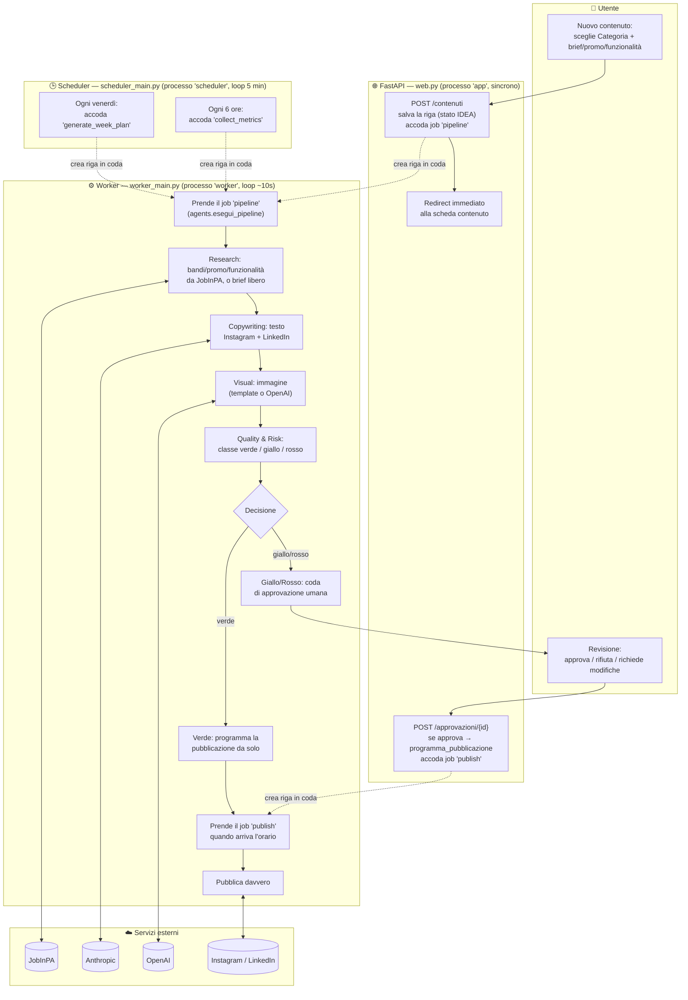

# Flusso del sistema: chi avvia, chi esegue

Questo documento traccia il percorso reale di un contenuto, dalla creazione
alla pubblicazione, indicando per ogni passaggio **chi lo avvia** e **chi lo
esegue davvero**. Per la mappa statica dei componenti (processi, database,
agenti) vedi [architecture.md](architecture.md); qui l'ottica è il percorso
nel tempo, non l'elenco dei pezzi.

## Attori

| Attore | Cos'è | Sincrono/asincrono |
|---|---|---|
| **Utente** | Chi usa la dashboard nel browser (editor/reviewer/admin) | — |
| **FastAPI** (processo `app`) | `src/social/web.py`: riceve le richieste HTTP, legge/scrive il DB, **non esegue mai l'AI o la pubblicazione lui stesso** | Sincrono: risponde entro la richiesta |
| **Worker** (processo `worker`, `worker_main.py`) | Consuma la coda `social_scheduled_jobs` uno alla volta, loop ogni ~10s | Asincrono: il lavoro vero (AI, immagini, pubblicazione) avviene qui |
| **Scheduler** (processo `scheduler`, `scheduler_main.py`) | Semina job ricorrenti (piano settimanale, raccolta metriche), loop ogni 5 min | Asincrono, non esegue nulla lui stesso: crea solo righe in coda |
| **JobInPA** | API interne (`/api/internal/bandi`, `/promozioni`, `/funzionalita`) | Servizio esterno, sola lettura |
| **Anthropic** | LLM per i testi (Research/Copywriting/Quality&Risk) | Servizio esterno |
| **OpenAI** | Generazione immagini (quando abilitata) | Servizio esterno |
| **Instagram/LinkedIn** | Pubblicazione reale | Servizio esterno |

Il punto chiave: **FastAPI non fa mai lavoro pesante o lento nella richiesta
HTTP**. Crea una riga in `social_scheduled_jobs` e risponde subito — è
sempre il Worker, in un processo separato, a eseguire ricerca, scrittura
testi, generazione immagini e pubblicazione. Per questo la scheda di un
contenuto appena creato mostra "in coda" invece del risultato immediato.

## Flusso principale: creazione → pubblicazione

## Passo per passo

1. **Utente** compila "Nuovo contenuto": sceglie una **Categoria** (decide
   da sola la strategia — bandi JobInPA, promozioni, funzionalità, o
   libera) e un brief/selezione.
2. **FastAPI** (`web.crea_contenuto`) salva subito la riga `social_content`
   (stato `IDEA`) e crea una riga in `social_scheduled_jobs` di tipo
   `pipeline` — poi risponde immediatamente con un redirect. Non fa altro.
3. **Worker**, al primo giro utile del suo loop, reclama quel job
   (lock atomico in `db_social.prendi_job`) ed esegue
   `agents.esegui_pipeline`, che fa scorrere lo stato del contenuto
   attraverso gli agenti in sequenza, **nello stesso processo worker**:
   - *Research* — legge bandi/promozioni/funzionalità da JobInPA (o
     accetta il brief come fatto, per le categorie senza ricerca), tramite
     `jobinpa_client.py`;
   - *Copywriting* — chiama Anthropic per le due varianti di testo;
   - *Visual* — genera l'immagine (Pillow deterministico, o OpenAI se
     abilitato e la categoria ha un prompt/immagini di riferimento);
   - *Quality & Risk* — classifica il rischio (regole fisse + giudizio
     Anthropic), decide `auto_publish` / `human_approval` / `blocked`.
4. Se la classe è **verde**, il Worker stesso chiama
   `agents.programma_pubblicazione`, che crea una riga `social_content`
   in stato `SCHEDULED` e un nuovo job `publish` con l'orario della
   prossima finestra utile — nessun umano coinvolto.
5. Se la classe è **giallo/rosso**, il contenuto entra nella coda di
   approvazione (`social_approvals`). **L'Utente** (reviewer) decide da
   "Revisione": approva, rifiuta, o chiede modifiche.
   - Approvando, è di nuovo **FastAPI** (dentro la stessa richiesta HTTP,
     sincrono) a chiamare `programma_pubblicazione` e creare il job
     `publish` — qui FastAPI esegue lavoro "vero" perché programmare non
     richiede AI né chiamate esterne lente.
   - Chiedendo modifiche, viene accodato un nuovo job `pipeline` che
     rifà research→copywriting→visual→quality tenendo conto della nota
     del revisore.
6. **Worker**, quando l'orario schedulato arriva, reclama il job
   `publish` ed esegue `publishing.pubblica_contenuto`, che dopo la
   catena di controlli di sicurezza (kill switch, account verificato,
   classe non rossa) chiama davvero l'API di Instagram o LinkedIn.
7. **Scheduler**, indipendentemente da tutto questo, ogni 5 minuti
   controlla se serve seminare job ricorrenti: il piano editoriale
   settimanale (ogni venerdì, agenti Supervisor) e la raccolta metriche
   (ogni 6 ore) — li accoda soltanto, è sempre il Worker a eseguirli.

## Perché in due processi separati (Worker/Scheduler) e non dentro FastAPI

- Una pipeline completa può richiedere diverse chiamate AI in sequenza
  (secondi, a volte oltre un minuto): tenerla nella richiesta HTTP
  bloccherebbe il browser dell'utente e rischierebbe timeout.
- Il Worker può fallire e ritentare un singolo job (backoff esponenziale,
  fino a 5 tentativi, poi stato `dead` visibile in dashboard) senza che
  l'utente se ne accorga o debba ripetere l'azione.
- `social_scheduled_jobs` (SQLite, lock atomico via `UPDATE ... WHERE`) è
  l'unico punto di coordinamento: niente Redis/Celery, un solo worker alla
  volta per job è garantito dal lock stesso.
